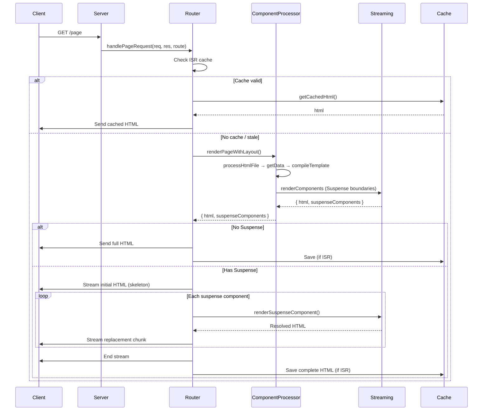
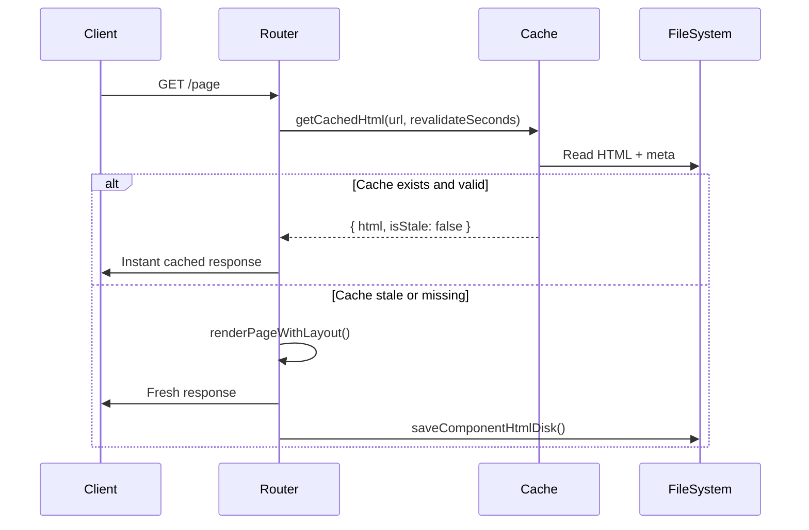
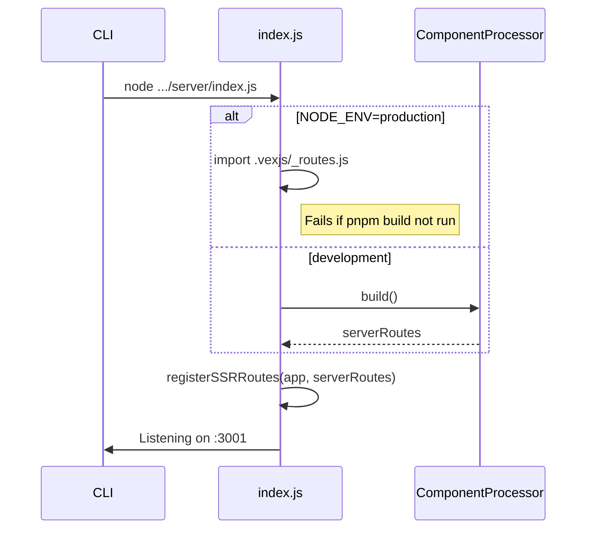

# @cfdez11/vex

[](https://www.npmjs.com/package/@cfdez11/vex)
[](#)
[](#)

A vanilla JavaScript meta-framework built on Express.js with file-based routing, multiple rendering strategies (SSR, CSR, SSG, ISR), streaming Suspense, and a Vue-like reactive system — no TypeScript, no bundler.

## Table of Contents

- [Installation](#installation)
- [Quick Start](#-quick-start)
- [Project Structure](#-project-structure)
- [Configuration](#-configuration-vexconfigjson)
- [Creating a Page](#-creating-a-page)
- [Components](#-components)
- [Rendering Strategies](#-rendering-strategies)
- [Layouts](#-layouts)
- [Suspense (Streaming)](#-suspense-streaming)
- [Reactive System](#-reactive-system)
- [Template Syntax](#-template-syntax)
- [Routing](#️-routing)
- [Prefetching](#-prefetching)
- [Styling](#-styling)
- [Framework API](#-framework-api)
- [Available Scripts](#-available-scripts)
- [Rendering Flow](#️-rendering-flow)
- [Roadmap](#️-roadmap)

## Installation

```bash
npm install @cfdez11/vex
```

Requires **Node.js >= 18**.

## 🚀 Quick Start

```bash
mkdir my-app && cd my-app
npm init -y
npm install @cfdez11/vex
npm install -D tailwindcss npm-run-all
```

Update `package.json`:

```json
{
  "type": "module",
  "scripts": {
    "dev":     "run-p dev:*",
    "dev:app": "vex dev",
    "dev:css": "npx @tailwindcss/cli -i ./src/input.css -o ./public/styles.css --watch",
    "build":   "vex build",
    "start":   "vex start"
  }
}
```

Create the minimum structure:

```bash
mkdir -p pages src public
echo '@import "tailwindcss";' > src/input.css
```

```bash
npm run dev
# → http://localhost:3001
```

## 📁 Project Structure

```
my-app/
├── pages/                    # File-based routes
│   ├── layout.vex            # Root layout (wraps all pages)
│   ├── page.vex              # Home page  →  /
│   ├── about/page.vex        # About page →  /about
│   ├── users/[id]/page.vex   # Dynamic    →  /users/:id
│   ├── not-found/page.vex    # 404 handler
│   └── error/page.vex        # 500 handler
├── components/               # Reusable .vex components (any subfolder works)
├── utils/                    # User utilities (e.g. delay.js)
├── public/                   # Static assets served at /
│   └── styles.css            # Compiled Tailwind output
├── src/
│   └── input.css             # Tailwind entry point
├── root.html                 # HTML shell template (optional override)
└── vex.config.json           # Framework config (optional)
```

> Generated files are written to `.vexjs/` — do not edit them manually.

### Custom source directory

If you prefer to keep all app code in a subfolder, set `srcDir` in `vex.config.json`:

```
my-app/
├── app/               ← srcDir: "app"
│   ├── pages/
│   └── components/
├── public/
└── vex.config.json
```

## ⚙️ Configuration (`vex.config.json`)

Optional file at the project root.

```json
{
  "srcDir": "app",
  "watchIgnore": ["dist", "coverage"]
}
```

| Field | Type | Default | Description |
|-------|------|---------|-------------|
| `srcDir` | `string` | `"."` | Directory containing `pages/`, `components/` and all user `.vex` files. When set, the dev watcher only observes this folder instead of the whole project root. |
| `watchIgnore` | `string[]` | `[]` | Additional directory names to exclude from the dev file watcher. Merged with the built-in list: `node_modules`, `dist`, `build`, `.git`, `.vexjs`, `coverage`, `.next`, `.nuxt`, `tmp`, and more. |

## 📄 Creating a Page

```html
<!-- pages/example/page.vex -->
<script server>
  import UserCard from "@/components/user-card.vex";

  const metadata = { title: "My Page", description: "Page description" };

  async function getData({ req }) {
    return { message: "Hello from the server" };
  }
</script>

<script client>
  import Counter from "@/components/counter.vex";
</script>

<template>
  <h1>{{message}}</h1>
  <Counter start="0" />
  <UserCard :userId="1" />
</template>
```

Routes are auto-generated from the `pages/` folder — no manual registration needed.

## 🧩 Components

Components are `.vex` files. They can live in any folder; the default convention is `components/`.

### Component structure

```html
<!-- components/counter.vex -->
<script client>
  import { reactive, computed } from "vex/reactive";

  const props = xprops({ start: { default: 0 } });
  const count = reactive(props.start);
  const stars = computed(() => "⭐".repeat(count.value));
</script>

<template>
  <div>
    <button @click="count.value--">-</button>
    <span>{{count.value}}</span>
    <button @click="count.value++">+</button>
    <div>{{stars.value}}</div>
  </div>
</template>
```

### Server components

```html
<!-- components/user-card.vex -->
<script server>
  const props = xprops({ userId: { default: null } });

  async function getData({ props }) {
    const user = await fetch(`https://api.example.com/users/${props.userId}`)
      .then(r => r.json());
    return { user };
  }
</script>

<template>
  <div>
    <h3>{{user.name}}</h3>
    <p>{{user.email}}</p>
  </div>
</template>
```

### Using components

Import them in any page or component:

```html
<script server>
  import UserCard from "@/components/user-card.vex";
</script>

<script client>
  import Counter from "@/components/counter.vex";
</script>

<template>
  <Counter :start="5" />
  <UserCard :userId="1" />
</template>
```

### Component props (`xprops`)

```js
const props = xprops({
  userId: { default: null },
  label:  { default: "Click me" },
});
```

Pass them from the parent template:

```html
<UserCard :userId="user.id" label="Profile" />
```

## 🎭 Rendering Strategies

Configured via `metadata` in `<script server>`.

### SSR — Server-Side Rendering (default)

Rendered fresh on every request. Best for dynamic, personalised or SEO-critical pages.

```html
<script server>
  const metadata = { title: "Live Data" };

  async function getData() {
    const data = await fetch("https://api.example.com/data").then(r => r.json());
    return { data };
  }
</script>

<template>
  <h1>{{data.title}}</h1>
</template>
```

### CSR — Client-Side Rendering

No server-rendered HTML. The page fetches its own data in the browser. Use for highly interactive or authenticated areas.

```html
<script client>
  import { reactive } from "vex/reactive";

  const data = reactive(null);

  fetch("/api/data").then(r => r.json()).then(v => data.value = v);
</script>

<template>
  <div x-if="data.value">
    <h1>{{data.value.title}}</h1>
  </div>
  <div x-if="!data.value">Loading…</div>
</template>
```

### SSG — Static Site Generation

Rendered once and cached forever. Best for content that rarely changes.

```html
<script server>
  const metadata = { title: "Docs", static: true };

  async function getData() {
    return { content: await fetchDocs() };
  }
</script>
```

### ISR — Incremental Static Regeneration

Cached but automatically regenerated after N seconds. Best of speed and freshness.

```html
<script server>
  const metadata = {
    title: "Weather",
    revalidate: 60,   // regenerate every 60 s
  };

  async function getData({ req }) {
    const { city } = req.params;
    const weather = await fetchWeather(city);
    return { city, weather };
  }
</script>
```

**`revalidate` values:**

| Value | Behaviour |
|-------|-----------|
| `10` (number) | Regenerate after N seconds |
| `true` | Regenerate after 60 s |
| `0` | Stale-while-revalidate (serve cache, regenerate in background) |
| `false` / `"never"` | Pure SSG — never regenerate |
| _(omitted)_ | SSR — no caching |

## 📐 Layouts

### Root layout

`pages/layout.vex` wraps every page:

```html
<script server>
  const props = xprops({ children: { default: "" } });
</script>

<template>
  <header>
    <nav>
      <a href="/" data-prefetch>Home</a>
      <a href="/about" data-prefetch>About</a>
    </nav>
  </header>
  <main>{{props.children}}</main>
  <footer>© 2026</footer>
</template>
```

### Nested layouts

Add a `layout.vex` inside any subdirectory:

```
pages/
  layout.vex               ← wraps everything
  docs/
    layout.vex             ← wraps /docs/* only
    page.vex
    getting-started/page.vex
```

## ⏳ Suspense (Streaming)

Streams a fallback immediately while a slow component loads:

```html
<script server>
  import SlowCard     from "@/components/slow-card.vex";
  import SkeletonCard from "@/components/skeleton-card.vex";
</script>

<template>
  <Suspense :fallback="<SkeletonCard />">
    <SlowCard :userId="1" />
  </Suspense>
</template>
```

The server sends the skeleton on the first flush, then replaces it with the real content via a streamed `<template>` tag when it resolves.

## 🔄 Reactive System

Mirrors Vue 3's Composition API. Import from `vex/reactive` in `<script client>` blocks.

### `reactive(value)`

```js
import { reactive } from "vex/reactive";

// Primitives → access via .value
const count = reactive(0);
count.value++;

// Objects → direct property access
const state = reactive({ x: 1, name: "Alice" });
state.x++;
state.name = "Bob";
```

### `computed(getter)`

```js
import { reactive, computed } from "vex/reactive";

const price = reactive(100);
const qty   = reactive(2);
const total = computed(() => price.value * qty.value);

console.log(total.value); // 200
price.value = 150;
console.log(total.value); // 300
```

### `effect(fn)`

Runs immediately and re-runs whenever its reactive dependencies change.

```js
import { reactive, effect } from "vex/reactive";

const count = reactive(0);
const stop = effect(() => document.title = `Count: ${count.value}`);

count.value++; // effect re-runs
stop();        // cleanup
```

### `watch(source, callback)`

Runs only when the source changes (not on creation).

```js
import { reactive, watch } from "vex/reactive";

const count = reactive(0);
watch(() => count.value, (newVal, oldVal) => {
  console.log(`${oldVal} → ${newVal}`);
});
```

### Reactivity summary

| Function | Auto-runs | Returns |
|----------|-----------|---------|
| `reactive()` | No | Proxy |
| `effect()` | Yes (immediately + on change) | Cleanup fn |
| `computed()` | On dependency change | Reactive value |
| `watch()` | Only on change | — |

## 📝 Template Syntax

| Syntax | Description |
|--------|-------------|
| `{{expr}}` | Interpolation |
| `x-if="expr"` | Conditional rendering |
| `x-for="item in items"` | List rendering |
| `x-show="expr"` | Toggle `display` |
| `:prop="expr"` | Dynamic prop/attribute |
| `@click="handler"` | Event (client only) |

```html
<template>
  <h1>Hello, {{name}}</h1>

  <ul>
    <li x-for="item in items">{{item}}</li>
  </ul>

  <div x-if="isVisible">Visible</div>

  <button :disabled="count.value <= 0" @click="count.value--">-</button>
</template>
```

> Keep logic in `getData` rather than inline expressions. Ternaries and filters are not supported in templates.

## 🛣️ Routing

### File-based routes

| File | Route |
|------|-------|
| `pages/page.vex` | `/` |
| `pages/about/page.vex` | `/about` |
| `pages/users/[id]/page.vex` | `/users/:id` |
| `pages/not-found/page.vex` | 404 |
| `pages/error/page.vex` | 500 |

### Dynamic routes

```html
<!-- pages/users/[id]/page.vex -->
<script server>
  async function getData({ req }) {
    const { id } = req.params;
    return { user: await fetchUser(id) };
  }
</script>

<template>
  <h1>{{user.name}}</h1>
</template>
```

### Pre-generate dynamic pages (SSG)

```js
// inside <script server>
export async function getStaticPaths() {
  return [
    { params: { id: "1" } },
    { params: { id: "2" } },
  ];
}
```

### Client-side navigation

```js
window.app.navigate("/about");
```

### Route & query params (client)

```js
import { useRouteParams } from "vex/navigation";
import { useQueryParams } from "vex/navigation";

const { id }     = useRouteParams();  // reactive, updates on navigation
const { search } = useQueryParams();
```

## ⚡ Prefetching

Add `data-prefetch` to any `<a>` tag to prefetch the page when the link enters the viewport:

```html
<a href="/about" data-prefetch>About</a>
```

The page component is loaded in the background; navigation to it is instant.

## 🎨 Styling

The framework uses **Tailwind CSS v4**. The dev script watches `src/input.css` and outputs to `public/styles.css`.

```css
/* src/input.css */
@import "tailwindcss";
```

Reference the stylesheet in `root.html`:

```html
<link rel="stylesheet" href="/styles.css">
```

## 🔧 Framework API

### Import conventions

| Pattern | Example | Behaviour |
|---------|---------|-----------|
| `vex/*` | `import { reactive } from "vex/reactive"` | Framework singleton — shared instance across all components |
| `@/*` | `import store from "@/utils/store.js"` | Project alias for your source root — also a singleton |
| `./` / `../` | `import { fn } from "./helpers.js"` | Relative user file — also a singleton |
| npm bare specifier | `import { format } from "date-fns"` | Bundled inline by esbuild |

All user JS files (`@/` and relative) are pre-bundled at startup: npm packages are inlined, while `vex/*`, `@/*`, and relative imports stay external. The browser's ES module cache guarantees every import of the same file returns the same instance — enabling shared reactive state across components without a dedicated store library.

### Client script imports

| Import | Description |
|--------|-------------|
| `vex/reactive` | Reactivity engine (`reactive`, `computed`, `effect`, `watch`) |
| `vex/navigation` | Router utilities (`useRouteParams`, `useQueryParams`) |

### Server script hooks

| Export | Description |
|--------|-------------|
| `async getData({ req, props })` | Fetches data; return value is merged into template scope |
| `metadata` / `async getMetadata({ req, props })` | Page-level config (`title`, `description`, `static`, `revalidate`) |
| `async getStaticPaths()` | Returns `[{ params }]` for pre-rendering dynamic routes |

## 📦 Available Scripts

```bash
vex dev     # Start dev server with HMR (--watch)
vex build   # Pre-render pages, generate routes, bundle client JS
vex start   # Production server (requires a prior build)
```

> `vex start` requires `vex build` to have been run first.

## 🏗️ Rendering Flow

### SSR (Server-Side Rendering)



### ISR (Incremental Static Regeneration)



### Server Startup



## 🗺️ Roadmap

- [x] File-based routing with dynamic segments
- [x] SSR / CSR / SSG / ISR rendering strategies
- [x] Incremental Static Regeneration with background revalidation
- [x] Static path pre-generation (`getStaticPaths`)
- [x] Auto-generated server and client route registries
- [x] Streaming Suspense with fallback UI
- [x] Vue-like reactive system (`reactive`, `computed`, `effect`, `watch`)
- [x] Nested layouts per route
- [x] SPA client-side navigation
- [x] Prefetching with IntersectionObserver
- [x] Server-side data caching (`withCache`)
- [x] HMR (hot reload) in development
- [x] Component props (`xprops`)
- [x] `vex/` import prefix for framework utilities
- [x] `vex.config.json` — configurable `srcDir` and `watchIgnore`
- [x] Published to npm as `@cfdez11/vex`
- [x] VS Code extension with syntax highlighting and go-to-definition
- [ ] Refactor client component prop pipeline: evaluate `:props` expressions directly in `streaming.js` with the page scope instead of going through `template.js` → `String()` → `JSON.stringify` → `JSON.parse`. Eliminates the unnecessary serialization round-trip for array/object props.
- [ ] esbuild minification: enable `minify: true` in `generateClientBundle` and `buildUserFile` for production builds. Zero-cost win — esbuild is already in the pipeline.
- [ ] esbuild source maps: enable `sourcemap: "inline"` in dev mode so browser devtools show original source instead of the bundle.
- [ ] esbuild browser target: add `target: ["es2020"]` (or configurable) to transpile modern syntax for broader browser compatibility.
- [ ] esbuild code splitting: shared npm packages (e.g. `date-fns`) are currently inlined into every component bundle separately. Code splitting would emit a shared chunk, reducing total download size when multiple components share the same dependency.
- [ ] Devtools
- [ ] Typescript in framework
- [ ] Allow typescript to devs
- [ ] Improve extension (hightlight, redirects, etc)
- [ ] Create theme syntax
- [ ] Create docs page
- [ ] Authentication middleware
- [ ] CDN cache integration
- [ ] Fix Suspense marker replacement with multi-root templates
