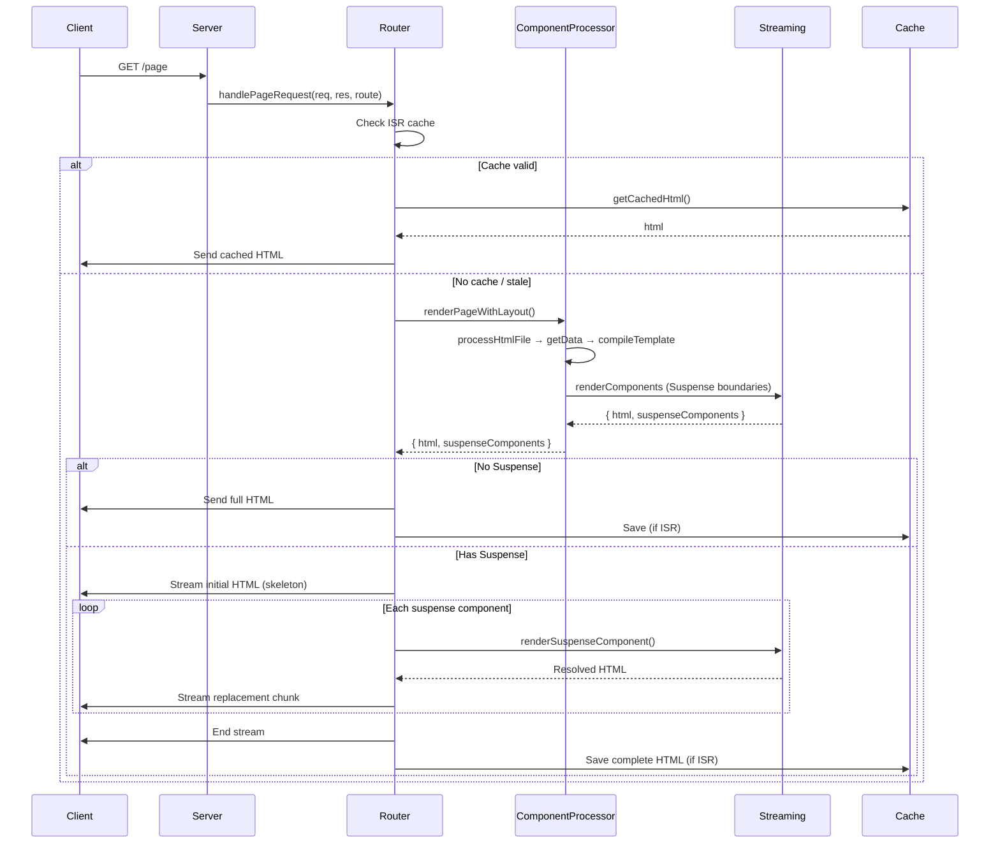
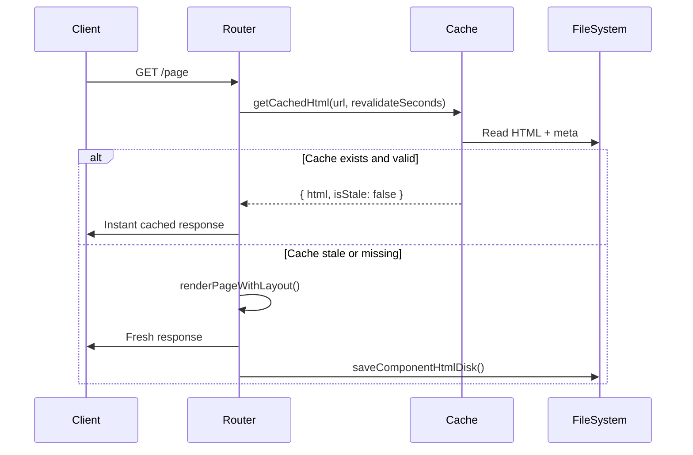
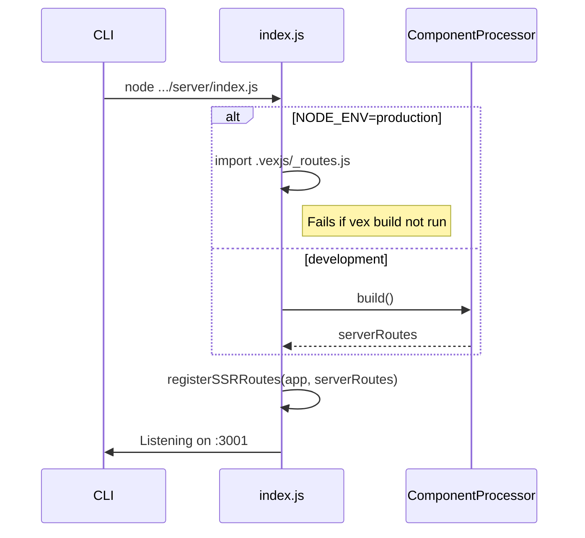

# Rendering Strategies

Configured via `metadata` in `<script server>`.

## SSR — Server-Side Rendering (default)

Rendered fresh on every request. Best for dynamic, personalised or SEO-critical pages.

```html
<script server>
  const metadata = { title: "Live Data" };

  async function getData() {
    const data = await fetch("https://api.example.com/data").then(r => r.json());
    return { data };
  }
</script>

<template>
  <h1>{{data.title}}</h1>
</template>
```

## CSR — Client-Side Rendering

No server-rendered HTML. The page fetches its own data in the browser. Use for highly interactive or authenticated areas.

```html
<script client>
  import { reactive } from "vex/reactive";

  const data = reactive(null);
  fetch("/api/data").then(r => r.json()).then(v => data.value = v);
</script>

<template>
  <div x-if="data.value">
    <h1>{{data.value.title}}</h1>
  </div>
  <div x-if="!data.value">Loading…</div>
</template>
```

## SSG — Static Site Generation

Rendered once and cached forever. Best for content that rarely changes.

```html
<script server>
  const metadata = { title: "Docs", static: true };

  async function getData() {
    return { content: await fetchDocs() };
  }
</script>
```

## ISR — Incremental Static Regeneration

Cached but automatically regenerated after N seconds. Best of speed and freshness.

```html
<script server>
  const metadata = {
    title: "Weather",
    revalidate: 60,   // regenerate every 60 s
  };

  async function getData({ req }) {
    const { city } = req.params;
    return { city, weather: await fetchWeather(city) };
  }
</script>
```

### `revalidate` values

| Value | Behaviour |
|-------|-----------|
| `10` (number) | Regenerate after N seconds |
| `true` | Regenerate after 60 s |
| `0` | Stale-while-revalidate (serve cache, regenerate in background) |
| `false` / `"never"` | Pure SSG — never regenerate |
| _(omitted)_ | SSR — no caching |

## Rendering Flow

### SSR



### ISR



### Server Startup


